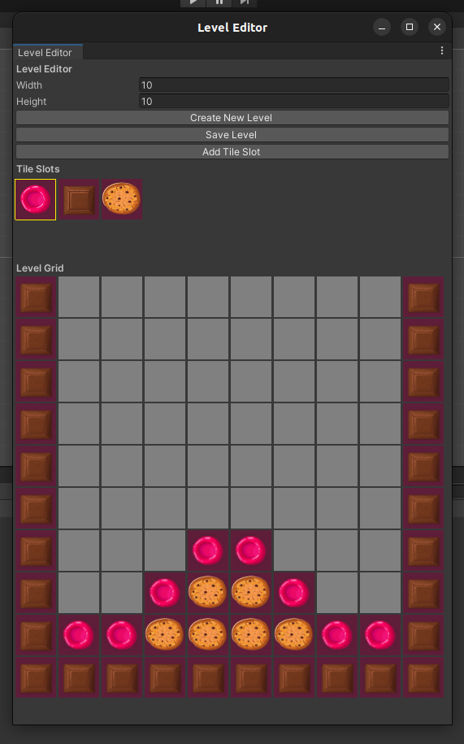

# M3 Level Editor - PoC (WIP)

## Overview

This project serves as a Proof of Concept (PoC) for a level editor tool designed for Unity. The purpose of this tool is to facilitate the creation and editing of levels for a Match3-style game. This project is currently a work in progress. The goal is to enhance my understanding and skills in developing custom editor tools for game development within the Unity environment.

Please note that as a PoC, the current state of the tool may be incomplete and may not represent final production quality.

## Features

- **Level Creation**: Define the width and height of your level grid and populate it with tiles.
- **Tile Management**: Add, select, and place tiles within the level grid using a user-friendly interface.
- **Level Export**: Save your created levels as ScriptableObject assets for easy management and retrieval.

## Pending Features

The following features are planned for future development to enhance the functionality of the level editor:

- **Load Level Data**: A feature to load existing level data into the editor for modification.
- **Multi-Layer Grid**: Support for adding multiple tiles at the same position to accommodate various tile types within the game, such as obstacles, power-ups, and layered backgrounds.
- **Tileset Management**: Extending the tile management system to handle a variety of tilesets and categorize them according to their types and behaviors.

